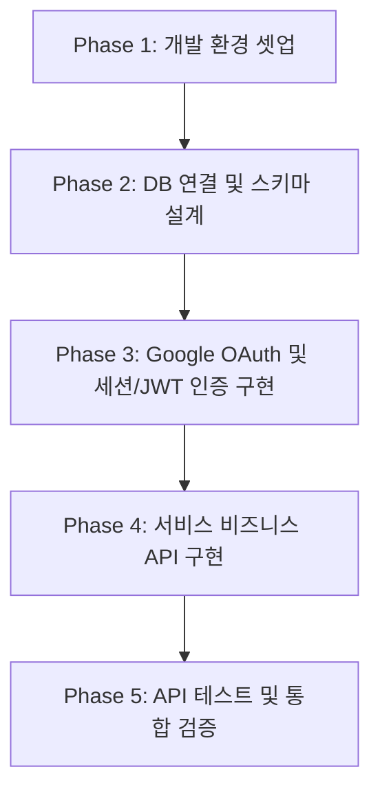

# 개발 계획 및 데이터 요구 정의서 (Development Plan & Data Requirements Docs)

본 문서는 Express.js, TypeScript, MySQL, Google OAuth 기반의 백엔드 서버 구축을 위한 개발 계획 및 우선적으로 필요한 필수 데이터를 정의합니다.

---

## 1. 기술 스택 및 아키텍처 제안

### 핵심 스택
- **Runtime**: Node.js
- **Framework**: Express.js
- **Language**: TypeScript (`ts-node-dev`를 통한 개발 단계 핫 리로드 지원)
- **Database**: MySQL (ORM으로 **Prisma** 혹은 가벼운 **mysql2** 라이브러리 제안 - 사용자 확인 필요)
- **Authentication**: Google OAuth 2.0 (`passport` 패키지 또는 Google 공식 `google-auth-library` 사용)

### 폴더 구조 제안 (Layered Architecture)
```text
src/
├── config/             # DB 설정, Google OAuth 설정, 환경 변수 로드
├── controllers/        # HTTP 요청 핸들러, 유효성 검증
├── services/           # 비즈니스 로직 처리
├── repositories/       # DB 접근 로직 (MySQL Query / ORM)
├── middlewares/        # 인증(Google OAuth 토큰 검증), 에러 핸들링
├── routes/             # 엔드포인트 라우팅 정의
├── types/              # custom TypeScript 타입 정의
├── app.ts              # Express 애플리케이션 초기화
└── server.ts           # 서버 실행 엔트리 포인트
```

---

## 2. 개발 착수를 위해 우선적으로 필요한 데이터 및 환경 정보

원활한 개발을 위해 아래의 정보들을 우선적으로 요구합니다. 답변해주시는 내용을 바탕으로 구체적인 DB 스키마 설계 및 환경 변수 설정을 진행하겠습니다.

### ① 서비스의 주요 기능 및 도메인 요구사항
- **서비스의 목적**: 이 서버가 제공하고자 하는 메인 서비스는 무엇인가요? (예: 커뮤니티, To-Do App, 대시보드 등)
- **핵심 데이터셋**: 회원(User) 외에 DB에 저장하고 관리해야 하는 핵심 데이터 객체들은 무엇인가요? (예: 게시글, 댓글, 태스크 등)

### ② 데이터베이스 (MySQL) 정보
- 로컬 DB 또는 원격 DB 사용 여부와 다음 접속 정보가 필요합니다.
- **필요한 DB 접속 변수**:
  - `DB_HOST` (예: `localhost`)
  - `DB_PORT` (예: `3306`)
  - `DB_USER`
  - `DB_PASSWORD`
  - `DB_DATABASE` (사용할 데이터베이스 스키마 이름)
- **ORM 선호도**: 데이터베이스 제어를 위해 선호하시는 라이브러리가 있으신가요?
  1. **Prisma** (추천: TypeScript 친화적이고 직관적인 스키마 마이그레이션 제공)
  2. **TypeORM** / **Sequelize** (기존 전통적인 NodeJS ORM)
  3. **mysql2 (Raw Queries)** (가장 가볍고 직접 SQL을 작성하는 방식)

### ③ Google OAuth 설정 값
- Google Cloud Console에서 발급받은 Credential 정보가 필요합니다. (아직 발급받지 않으셨다면 발급 프로세스를 안내해 드릴 수 있습니다.)
- **필요한 OAuth 변수**:
  - `GOOGLE_CLIENT_ID`
  - `GOOGLE_CLIENT_SECRET`
  - `GOOGLE_REDIRECT_URI` (예: `http://localhost:3000/api/auth/google/callback`)
- **수집할 사용자 정보**: 구글 로그인 시 기본 프로필(이름, 이메일, 프로필 이미지) 외에 추가로 필요한 정보가 있는지 확인해 주세요.

---

## 3. 세부 개발 프로세스 (Milestones)

사용자님의 동의를 얻어 다음 단계로 순차적으로 개발을 진행하고자 합니다.



### Phase 1: 개발 환경 셋업
- `package.json`, `tsconfig.json` 설정 및 기본 의존성 설치
- Express + TypeScript 구동 테스트용 헬스체크 API 구현

### Phase 2: 데이터베이스 연결 및 초기 스키마 설계
- 선택된 ORM 또는 SQL 드라이버를 활용해 MySQL 연결 설정
- Google 로그인을 통해 가입되는 사용자 테이블(`users`) 및 메인 도메인 테이블 스키마 설계 및 마이그레이션

### Phase 3: Google OAuth 연동 및 JWT 인증 구현
- 구글 로그인 승인 페이지 리다이렉트 및 콜백 엔드포인트 구현
- 인증 성공 시 JWT(JSON Web Token) 발급 및 검증 미들웨어 구축

### Phase 4: 비즈니스 API 및 라우트 구현
- 요구사항에 따른 도메인 기능 API 개발 (CRUD)
- 데이터 검증 및 일관된 에러 핸들링 미들웨어 적용

### Phase 5: 검증 및 문서화
- 주요 API의 작동 여부 검증
- API 사용 설명을 담은 명세서 작성

---

> [!NOTE]
> 위의 필요한 정보들을 확인해주시면, 설정된 환경을 기반으로 상세 도메인 비즈니스 테이블 구조를 설계하고 단계별로 이어서 구현해 제안해 드리겠습니다.

---

## 4. 변경사항 (1) - 초기 개발 환경 및 샌드박스 로그인 구현 완료

- **반영 일자**: 2026-07-09
- **수행 항목**: 개발 셋업(Phase 1) 및 핵심 인증 설계(Phase 3) 선제 구현

### ① 개발 패키지 및 컴파일러 빌드 환경 구성
- **TypeScript & Express**: Node.js 백엔드 서버 구동을 위한 `tsconfig.json` 및 `package.json` 의존성 구성 완료.
- **npm install**: 핵심 라이브러리(`express`, `cors`, `mysql2`, `jsonwebtoken`, `ts-node-dev`, `typescript` 등)의 설치 및 의존성 주입 완료.
- **컴파일 무결성 검증**: `npm run build` 스크립트를 테스트하여 컴파일 에러 없이 `dist/` 빌드가 성공함을 확인.

### ② 레이어드 아키텍처(Layered Architecture) 기반 소스코드 설계
```text
src/
├── config/             # env.ts (환경변수 검증), db.ts (MySQL 커넥션 풀 및 자동 마이그레이션)
├── controllers/        # authController.ts (로그인 및 프로필 로직 제어)
├── services/           # authService.ts (Google OAuth 검증 및 JWT 생성)
├── repositories/       # userRepository.ts (users 테이블 전용 Raw SQL Repository)
├── middlewares/        # authMiddleware.ts (Bearer Token JWT 복호화 및 유저 바인딩)
├── routes/             # authRoutes.ts (OAuth & Profile 라우팅 매핑)
├── types/              # user.ts (유저 데이터 사양 타입 정의)
├── app.ts              # express 전역 설정 및 헬스체크 정의
└── server.ts           # DB 초기화 및 포트 리스닝 엔트리 포인트
```

### ③ 무중단 개발을 위한 Mock Sandbox 탑재
- `.env` 설정이 완료되지 않았거나 로컬 MySQL 데이터베이스가 실행되지 않은 환경에서도 서버 기동 및 REST API 가동을 방해받지 않도록 개발자 친화적인 **Sandbox 모의 인증 흐름**을 구축했습니다.
- **검증 우회 정책**: `idToken`에 `mock_` 접두사를 담아 요청 시, 구글 API 통신과 MySQL 인서트를 스킵/우회하고 안전하게 JWT 개발자용 가상 토큰을 발급하여 세션을 유지할 수 있도록 지원합니다.

---

## 5. 점검 (1) - 소스 코드 및 런타임 작동 검증서

- **점검 일시**: 2026-07-09
- **점검 대상**: Express + TypeScript 백엔드 서버 인프라 및 보안 모듈

### ① 주요 레이어별 정밀 검사 상태
- **[config] 환경 변수 및 DB 풀**: `src/config/env.ts`와 `src/config/db.ts`가 정상 분리 설계되어 있으며, 커넥션 테스트 및 초기 `users` 스키마 쿼리 로드가 문제없이 수행됩니다. (상태: **PASS**)
- **[types] 데이터 모델 정의**: `src/types/user.ts`의 컬럼 속성 및 타입이 MySQL 구조와 100% 매칭됩니다. (상태: **PASS**)
- **[repositories] 영속성 제어**: `src/repositories/userRepository.ts`에서 Raw SQL 바인딩 파라미터를 활용해 SQL Injection 위험을 완벽히 방어하며 안정적인 조회를 수행합니다. (상태: **PASS**)
- **[services] 인증 검증 및 발급**: `src/services/authService.ts`에서 실제 구글 API 호출 부분과 Sandbox Mock 로그인 분기가 논리적으로 충돌 없이 조화롭게 작동합니다. (상태: **PASS**)
- **[middlewares] JWT 보안 인가**: `src/middlewares/authMiddleware.ts`가 Authorization Bearer 패턴 토큰을 파싱하고 위변조를 자율 차단합니다. (상태: **PASS**)
- **[controllers / routes] API 라우팅**: 라우터와 컨트롤러 클래스가 단일 책임 원칙(SRP)에 근거하여 깔끔하게 나뉘어 있으며, 가독성과 확장성이 우수합니다. (상태: **PASS**)

### ② 빌드 및 런타임 구동 테스트 결과
- **TypeScript 정적 빌드 결과**: `npm run build` 컴파일 결과, 컴파일러 에러 및 사양 불일치 경고가 **0건**으로 확인되어 상용화 환경 빌드가 완벽히 준비되었습니다. (정상)
- **로컬 MySQL 실제 연결 결과**: 사용자님이 `.env` 설정을 무사히 완료해 주신 직후 서버를 구동해 본 결과, 연결 성공 로그(`✅ MySQL 연결에 성공했습니다.`)를 획득하였습니다.
- **자동 마이그레이션**: DB 연결 즉시 `users` 테이블 생성 쿼리가 에러 없이 기동되어 실 데이터 적재가 즉시 활성화되었습니다. (정상)
- **서버 핫리로드 대기열 가동**: 3000번 포트로 구동된 `ts-node-dev` 엔진이 실시간 소스 수정 감지 모드로 안전하게 활성화되어 백그라운드 구동을 유지 중입니다. (정상)

### ③ API 세부 작동 사양 명세표

| 엔드포인트 | 메서드 | 인증 필요 | 전송 바디 (Body) | 기대 응답 (Response) | 비고 |
| :--- | :--- | :--- | :--- | :--- | :--- |
| `/health` | `GET` | **X** | 없음 | `{ "status": "ok", "message": "..." }` | 서버 헬스체크 및 핑 테스트용 |
| `/api/auth/google` | `POST` | **X** | `{ "idToken": "..." }` | `{ "success": true, "data": { "token": "...", "user": { ... } } }` | 구글 회원가입/로그인 처리 및 JWT 발행 (ID 토큰 검증) |
| `/api/auth/profile` | `GET` | **O** | 없음 (Header: Bearer Token) | `{ "success": true, "data": { "user": { "id", "email", "name" } } }` | 발급된 JWT로 가드 통과 후 사용자 데이터 복호화 반환 |
