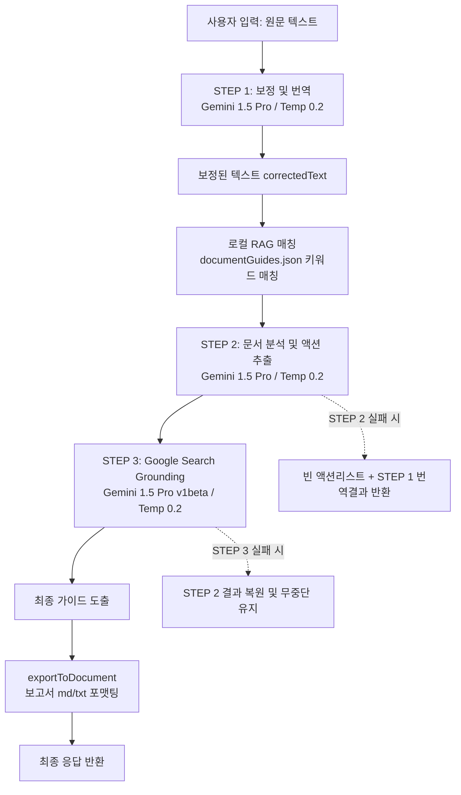

# 🌐 번역 + 행동 안내 (Action Guidance) 파이프라인 설계 스펙

본 문서는 `/api/translation/translate` API의 고도화를 위한 기술 스펙입니다. 단순 OCR 교정 및 번역을 넘어, 한국 생활에 정착하는 이민자 및 외국인들을 위한 실질적인 **행동 안내 지침(Action Guidance)**을 도출하는 3단계 순차 실행 파이프라인을 정의합니다.

---

## 🏗️ 1. 시스템 아키텍처 및 데이터 흐름

단일 프롬프트가 가질 수 있는 정확도 한계 및 할루시네이션(Hallucination) 리스크를 최소화하기 위해, 시스템은 다음과 같이 3단계의 독립된 Gemini 1.5 Pro 호출 파이프라인으로 구성됩니다.

### 🔄 데이터 흐름도



---

## 📂 2. RAG (경량 로컬 지식베이스) 스펙

행동 수칙의 도메인 정확성을 높이기 위해, 로컬 파일 시스템에 경량 가이드북을 구축합니다.

- **위치**: `src/knowledge/documentGuides.json`
- **구조**:
  ```json
  [
    {
      "category": "string",
      "displayName": "string",
      "keywords": ["string"],
      "guide": "string"
    }
  ]
  ```
- **카테고리 구성 (최소 8개)**:
  1. `utility_bill`: 공과금 고지서 납부 방법 (바코드, 가상계좌 등)
  2. `immigration_notice`: 외국인등록증(ARC), 비자 연장, 체류지 변경 신고
  3. `housing_lease`: 임대차 계약 후 확정일자 및 전입신고 의무
  4. `employment_contract`: 근로계약서 교부 의무, 최저임금 및 주휴수당
  5. `tax_bill`: 주민세, 자동차세 등 세금 납부(위택스 이용 등)
  6. `traffic_fine`: 교통 과태료, 의견제출 기한 자진 납부 감경(20%)
  7. `health_insurance`: 국민건강보험료 납부, 무료 건강검진 대상자 조회
  8. `court_document`: 법원 송달 서류, 답변서 제출 기한(30일) 및 행정처분 사전의견제출

---

## 🛠️ 3. 파이프라인 단계별 구현 명세

### 📍 STEP 1 — 보정 + 번역 (기존 로직 유지 및 고도화)
- **역할**: 입력 텍스트 내 OCR 오타를 정교하게 교정하고 타겟 언어로 깔끔히 번역함.
- **모델**: `gemini-1.5-pro` (기존 flash에서 업그레이드)
- **매개변수**: `temperature` 0.2 이하
- **실패 정책**: STEP 1 실패 시 핵심 프로세스 중단으로 인지하여 500 에러 반환.

### 📍 STEP 2 — 문서 분석 및 액션 추출
- **역할**: STEP 1의 `correctedText`를 RAG를 통한 한국 법적/행정적 지식베이스 컨텍스트와 함께 분석하여 최적의 액션 항목 도출.
- **매개변수**: `temperature` 0.2 이하
- **스키마**:
  ```typescript
  interface ActionGuidance {
    documentType: string;
    summary: string;
    actionItems: {
      action: string;
      deadline: string | null;
      priority: "high" | "medium" | "low";
      details: string;
    }[];
    warnings: string[];
  }
  ```
- **특수 프롬프트 지침**: "문서에 명시되지 않은 사실을 지어내지 말 것. 추론한 내용은 details에 '추정'임을 명시할 것"이라는 할루시네이션(Hallucination) 원천 봉쇄 문구 삽입.

### 📍 STEP 3 — 검색 기반 근거 보강 (Grounding)
- **역할**: Google Search Grounding 기능을 사용해 STEP 2에서 나온 `documentType`과 `actionItems`를 실제 검색 엔진으로 추가 교차 검증 및 보완.
- **API 사양**: `tools: [{ google_search: {} }]` 혹은 `tools: [{ googleSearch: {} }]` 활용.
- **실패 정책 (Graceful Degradation)**: 호출 실패, 네트워크 에러, 파싱 불능 등 문제 발생 시 STEP 2 분석본을 그대로 유지하며, 파이프라인 전체를 실패시키지 않음.

---

## 🚨 4. 에러 처리 및 방어 코드 (Defensive Programming)

1. **JSON 마크다운 제거**: Gemini 응답에 포함될 수 있는 마크다운 코드펜스(예: ` ```json ... ``` `)를 제거하는 디펜시브 파싱 헬퍼 제공.
2. **부분적 실패 처리**:
   - STEP 2/3이 예외를 발생시키거나 오작동하면 `actionItems: []`, `warnings: []` 및 `explanation`에 "행동 분석 실패"에 관한 친절한 한국어 안내 메시지를 붙여 반환함.

---

## 📥 5. 문서 다운로드 및 Swagger 연동

- **문서 내 "📌 해야 할 일" 색션 보강**: `exportToDocument`의 `.md` 및 `.txt` 생성 템플릿에 중요도별 이모지 및 데드라인 정보를 세련되게 구현.
- **Swagger 스키마 업데이트**: `src/swagger.ts`의 `/api/translation/translate` 응답 스키마에 추가 필드들을 투영함.
